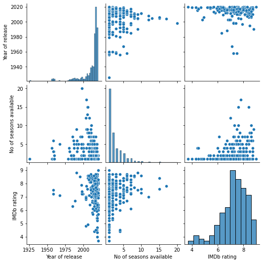

# Amazon-Prime-TV-Show

Data Source: [Amazon Prime TV shows](https://www.kaggle.com/nilimajauhari/amazon-prime-tv-shows)

**Some Brief content**

>The data set contains the name of the show or title, year of the release which is the year in which the show was released or went on-air, No.of seasons means the number of seasons of the show which are available on Prime, Language is for the audio language of the show and does not take into consideration the language of the subtitles, genre of the show like Kids, Drama, Action and so on, IMDB ratings of the show: though for many tv shows and kid shows the rating was not available, Age of Viewers is to specify the age of the target audience- All in age means that the content is not restricted to any particular age group and all audiences can view it.

# Result/Analysis Outcome

- Kids, Action, Drama, Comedy are the most watched Genre.
- Most of the TV Shows are in English language > 400 Series followed by Hindi Language < 50.
- The Year 2018 had Highest Number of TV shows releases > 75, followed by the year 2019, 2017 and 2016
- The TV shows ```[Forensic Files, NCIS, Grey's Anatomy, Supernatural, Doctor Who, Two and a Half Men, The Big Bang Theory, Blue Bloods, Shameless, Hawaii Five-O]``` have Seasons >= 10.

# Download the Project
```
# Clone or Download the Repository

- To clone: $ git clone https://github.com/Mega-Barrel/Amazon-Prime-Show.git

# Install the numpy, pandas, seaborn, matplotlib libraries.
```

# Checking the Null Values

```python
# Check for total Null values present
df.isnull().sum()
```
## ***Output***

Name of the show :            0

Year of release :             0

No of seasons available :     0

Language :                    0

Genre :                       0

IMDb rating :               283

Age of viewers :              0

# ***Using Median To fill the IMDb rating, Null Values***
```python
fill_val = df['IMDb rating'].median()
df['IMDb rating'].fillna(fill_val, inplace=True)
```

# Displaying some Visualization

- Plot for TV Show Genre released in 2020


- Pair Plot for TV shows


- Count Plot for TV shows Genre for the Data.


- Count Plot for Age Group


- Pair Plot for Languages used in Shows


- Plot for TV shows released in following Years


- Joint Plot


- Plot for IMDb Rating as per Languages


- Pair Plot for TV shows
  


# ***Enough of Data Visualization 😒🤦‍♂️, Some key findings***

- TV show Popular By Hindi Language
  


- TV show Popular By English Language
  


- TV show Popular By among Kids
  


- TV show Popular By Drama Genre
  


- TV show Popular By Action Genre
  


- TV show Popular By Horror Genre 😱🧛‍♂️
  

Sad Only 1 Movie In ```Horror``` Genre 😭

- TV show Popular By Drama, Comedy
  


- Popular TV show for max number of seasons with IMDb > 8 ratings
  


# ***Word Clouds***

### **Word Cloud For TV Series**


### **Word Cloud For Genre**
